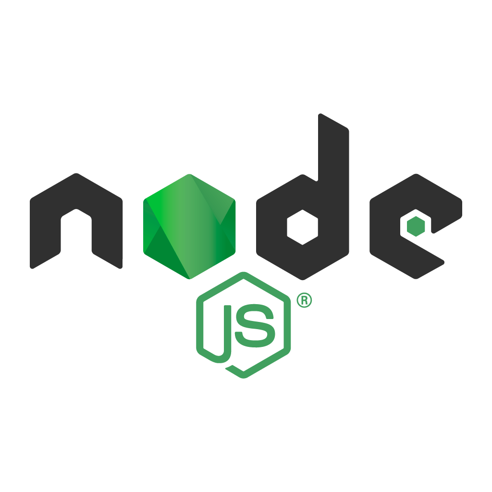

# 🚀 Learn Node.js

  

  <b>A structured journey into backend development using Node.js</b>

---

## 📖 About

This repository documents my progress while learning **Node.js**, covering core concepts, backend fundamentals, and real-world project building.

---

## 🧠 Topics Covered

### 🔰 Core Concepts

* ✅ Modules in Node.js
* [ ] File Handling (`fs`)
* [ ] HTTP Server
* [ ] Working with URLs

### 🌐 Web & APIs

* [ ] HTTP Methods
* [ ] REST APIs
* [ ] HTTP Headers
* [ ] HTTP Status Codes
* [ ] API Versioning

### ⚙️ Frameworks & Tools

* [ ] Express.js
* [ ] Postman (API Testing)
* [ ] Express Middleware

### 🗄️ Database & Architecture

* [ ] Node.js with MongoDB
* [ ] MVC (Model-View-Controller)

### 🔐 Authentication & Security

* [ ] Authentication
* [ ] JWT Authentication
* [ ] Cookies & Sessions
* [ ] Authorization

### 🚀 Projects & Advanced Topics

* [ ] Custom URL Shortener
* [ ] Server-Side Rendering (SSR)
* [ ] Discord Bot (Node.js)
* [ ] File Uploads (Multer)
* [ ] Project Setup & Structure

---

## 🎯 Objective

* Build a solid **backend foundation**
* Understand how real-world APIs work
* Develop **scalable and production-ready applications**

---

## 📌 Progress

✔️ Continuously updating as I learn and build
🛠️ Hands-on approach with projects and experiments

---

## 📈 What's Next?

More advanced topics, optimizations, and full-stack integrations coming soon...

---

  ⭐ If you find this useful, consider giving it a star!

